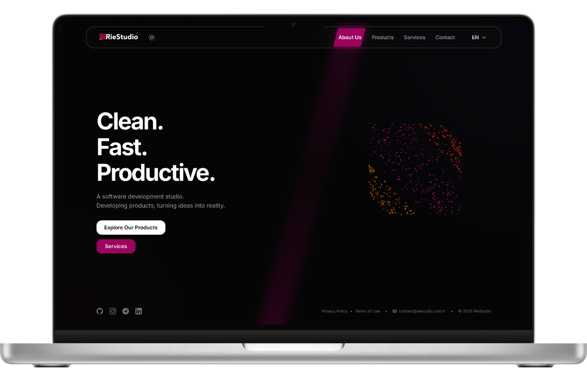

# RieStudio Web

Official website source code for RieStudio.

🌐 Live Website: https://www.riestudio.com.tr

---

  

## Overview

This repository contains the source code of the official RieStudio website.

The website showcases our projects, services and company information.

## Technologies

- HTML5
- CSS3
- Vanilla JavaScript
- Netlify

## Features

- Responsive design
- SEO optimized
- Static deployment
- GitHub Releases integration for APK downloads

## License

This project is licensed under the [MIT License](LICENSE).